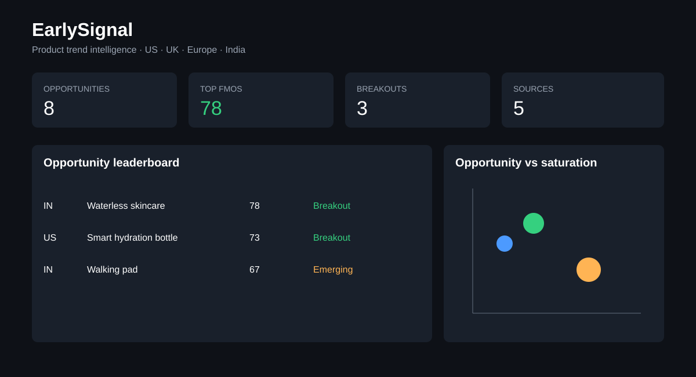
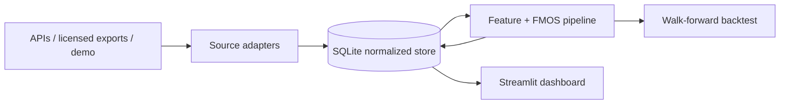

# EarlySignal Market Trends

Open-source trend intelligence for finding product opportunities early in the **United States, United Kingdom, Europe, and India**. EarlySignal combines search, social, marketplace, and media signals into an explainable **First-Mover Opportunity Score (FMOS)**, with market comparison and walk-forward backtesting.



## Quick start

```bash
python -m venv .venv
source .venv/bin/activate
pip install -r requirements.txt
cp .env.example .env
python -m earlysignal.cli init --demo
streamlit run app.py
```

Run the pipeline and tests:

```bash
python -m earlysignal.cli score
python -m earlysignal.cli backtest --horizon 14
python -m unittest discover -s tests -v
```

Regenerate the sample dataset with `python scripts/generate_demo.py`.

The included synthetic dataset covers US, GB, EU, and IN and makes every feature runnable without API keys. Here, **EU is an aggregate Europe market**, while GB represents the United Kingdom. Add individual European country codes when country-level resolution is needed. Demo data must not be used for commercial decisions.

## Score methodology

All components are clipped to 0–100 and calculated only from observations available at the scoring date.

| Component | Definition | FMOS weight |
|---|---|---:|
| Velocity | 7-day growth, 28-day growth, and recent slope | 30% |
| Cross-platform confidence | Source breadth, agreement, and completeness | 20% |
| Geographic diffusion | Mean momentum for the same product across the other markets | 10% |
| Commercial opportunity | Purchase intent, sentiment, and demand level | 25% |
| Saturation headroom | Inverse seller density, ad intensity, and incumbent share | 15% |

`FMOS = .30×velocity + .20×confidence + .10×diffusion + .25×commercial + .15×(100−saturation)`

The score is a prioritisation heuristic, not a demand forecast. See [methodology](docs/METHODOLOGY.md) for formulas and leakage controls.

## Data sources

The normalized `observations` table accepts any source. Included adapters:

- `demo`: deterministic synthetic search, Reddit, YouTube, marketplace, and news signals.
- `csv`: imports licensed exports and internal data.
- `google_trends`: contract for the official alpha API; requires approved access.
- `youtube`: YouTube Data API v3 keyword statistics; requires `YOUTUBE_API_KEY`.

Reddit, TikTok, Instagram, and marketplace scraping are intentionally not enabled: access and terms change, and unauthorized scraping is not a reliable open-source default. Import licensed/exported data through CSV.

CSV columns:

```text
observed_at,country,source,product,category,value,sentiment,purchase_intent,seller_count,ad_intensity,incumbent_share
```

## Architecture



SQLite keeps setup simple; the schema is portable to PostgreSQL. See [architecture notes](docs/ARCHITECTURE.md).

## Open-source references

Architecture and methodology were informed—not copied—by:

- [kodi-leith/TikTok-Trend-Detection](https://github.com/kodi-leith/TikTok-Trend-Detection): NLP and time-series detection feeding a product-manager dashboard.
- [flack0x/trendspyg](https://github.com/flack0x/trendspyg): Google Trends RSS/CSV ingestion patterns.
- [trendsapi-ai/trendsapi](https://github.com/trendsapi-ai/trendsapi): consistent cross-source time-series contracts.
- [Google Trends API Alpha](https://developers.google.com/search/apis/trends): official direction for consistently scaled historical data.
- [Google Trends export guidance](https://support.google.com/trends/answer/4365538): supported CSV export and attribution.

## Responsible use and limitations

- Demo values are synthetic. Live signals may be sampled, normalized, delayed, botted, or regionally biased.
- A high score is a research lead, not investment, inventory, or legal advice.
- Cross-country values should only be compared after source-specific normalization.
- Validate with interviews, landing-page tests, unit economics, and supplier checks.
- Respect platform terms, privacy law, rate limits, and data licenses. Store aggregates rather than personal data.

MIT licensed.
